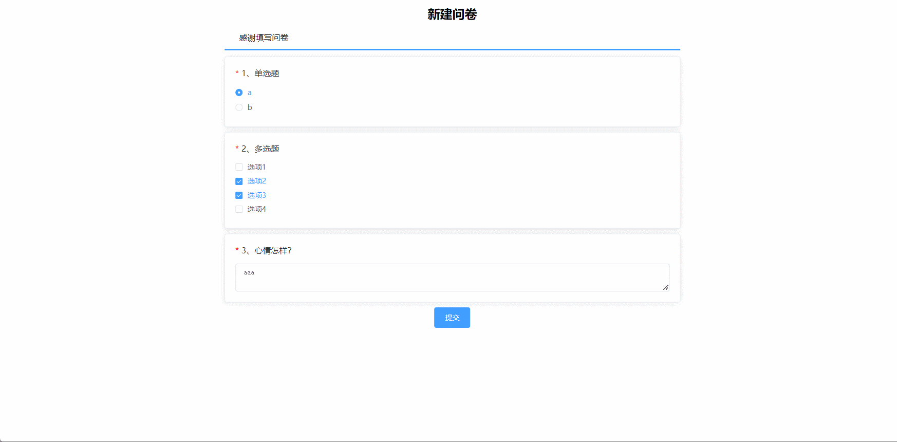

# questionnaire-system🎂

基于SpringBoot+Vue的问卷系统

## 介绍🌞

> 此次设计具体阐述了问卷设计、发布、数据收集与分析等核心功能的实施细节。管理端包含有echars图表更直观的分析问卷调查结果


## 项目演示🌞

> 管理员
>
> http://localhost/#/admin


> 普通用户
>
> http://localhost





## 安装教程🌞

```
1. 运行环境准备mysql8 + java8 + node14.16.1

2. 配置maven路径，加载依赖

3. 运行sql文件，确保application.yml或config.properties的数据库名称和账号密码是数据库所在主机的账号密码
```


## 使用说明🌞

```
1. 登入

    管理员账号：admin 密码：123456

    普通用户账号：zhangsan 密码：123456
  
2. 运行流程

SpringBoot+Vue项目的部署详情可以查看这篇CSDN博客：http://t.csdnimg.cn/kpuxS

前后端不分离项目的部署流程可以查看这篇CSDN博客：http://t.csdnimg.cn/CslA5
```


## CSDN项目合集🌞

点击前往：http://t.csdnimg.cn/Q4u84


## 联系我🌞

**有偿获取完整源码或调试代码**

🐧：1902317191

wx：coding1902317191


